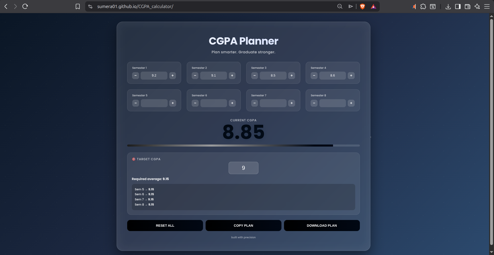
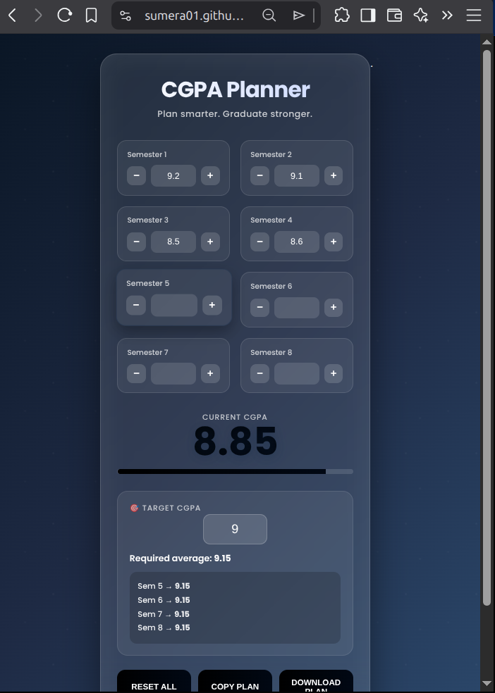
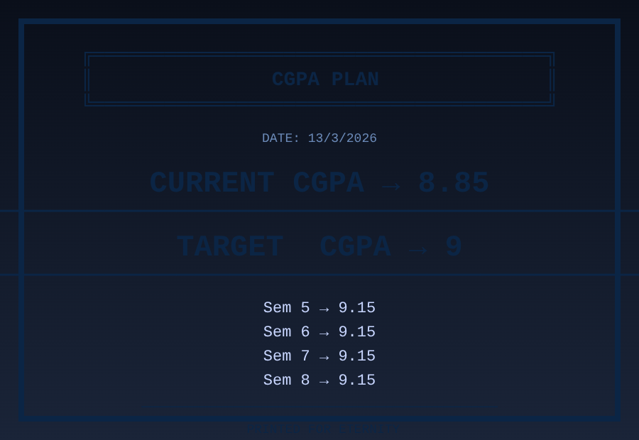

# CGPA Planner ✨


**A beautiful, modern, single-file CGPA planner** with glassmorphism design, live animations, local storage persistence, and a dramatic typewriter-style receipt download.

Built with pure HTML + CSS + JavaScript — no frameworks, no build step, just open and use.

---

### 🚀 Live Demo
**[→ Open CGPA Vibe](https://sumera01.github.io/CGPA_calculator/)**  

---

### 📸 Screenshots







---

---

### ✨ Features

- **Stunning Dark-Blue Glassmorphism** design (pure two-chromatic look)
- **4 semesters per row** on desktop — everything visible in one beautiful view
- **Smooth CGPA count-up animation**
- **Live progress bar** showing % toward your target
- **Smart target planner** — tells you exactly what SGPA you need in remaining semesters
- **Auto-save** with LocalStorage (your data stays even after closing the tab)
- **Three powerful buttons**:
  - Reset All
  - Copy Plan
  - **Download Receipt** — dramatic retro terminal PNG with typewriter effect
- Fully responsive (mobile-first + desktop optimized)
- Print-friendly
- Zero dependencies — just one HTML file

---

### 🛠️ Tech Stack

- HTML5
- CSS3 (Glassmorphism + custom properties + modern grid)
- Vanilla JavaScript (with canvas for receipt generation)
- Google Fonts (Poppins)

---

### 📥 How to Use

1. **Download** the single file: [`index.html`](index.html)
2. Open it in any browser (Chrome/Firefox/Safari recommended)
3. Start entering your semester scores
4. Set your target CGPA
5. Click **DOWNLOAD RECEIPT** for the beautiful printable image

**Pro tip**: Bookmark it or host on GitHub Pages for instant access anytime!

---

### 📁 Project Structure

```
cgpa-vibe/
├── index.html          ← The entire app (just one file!)
├── README.md
└── screenshots/
    ├── CGPA_Receipt_8.85.png
    ├── desktop.png
    └── phone.png
```

---

### 🎯 Why You'll Love It

- Cleanest possible UI
- Saves your progress automatically
- Gives you that "wow" feeling every time you open it
- Perfect for students who want something beautiful, not just functional

---

### 📝 License

This project is open-source under the **MIT License** — feel free to fork, modify, and use it.

---

### Made with ⭐ 

**Star the repo** if it helped you plan your semesters better! ⭐
**Made for students, by a student.**  
Now go get that 9.0+ CGPA 🔥

